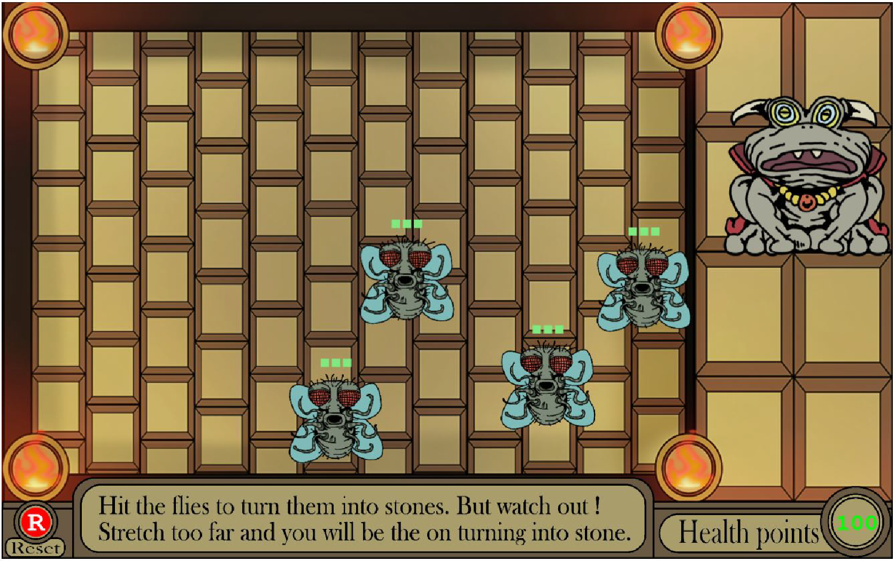
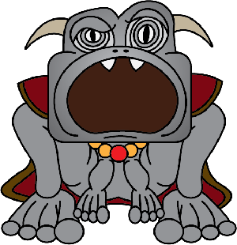
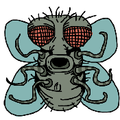

# DUNGEON FROG

AYDAN MC GRAIL

[View this project online](https://aydanmcgrail.github.io/MOD_JAM/)

## Description

In a dark dungeon a frog is trying to clean his room by getting rid of the flies. The frog is afflicted with a curse. If he moves too much, he will turn into stone. He can also transmit his curse to others. Through enough friction by contact, the frog can turn the flies into stones.

> In this game, extend the tongue by repeatedly pressing A. Repeatedly pressing B key will to pull it back. 

> You can change the frog's height with the mouse (mouseY), 

> The frog looses life points progressively when the tongue is extended. The amount of life points lost is tied to the length of the extention. 

>The more the tongue tip is overlapping one fly, the fly will loose one of his life points. When a certain fly as lost its 3 life points, it turns into stone. while a live fly will move away easily from the tongue tip, a stone fly will prevent the tongue tip to reach past it. The stone fly now acts as a blocking tool for the other live flies. 

## Screenshot(s)

Here is what the game looks like. 

> 

here is an image of the frog and a fly.

> 

> 

## Attribution

> - This project uses [p5.js](https://p5js.org).
> - Artworks made by me.

## License

> This project is licensed under a Creative Commons Attribution ([CC BY 4.0](https://creativecommons.org/licenses/by/4.0/deed.en)) license with the exception of libraries and other components with their own licenses.